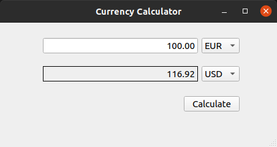

# Currency Calculator
It is a program written to practice with PyQt. Receives latest exchange rates from the European Central Bank. Calculates the entered amount from the selected currency into the desired currency.

# Installation
No installation required to use. Executable is in bin directory.

## For Windows
Click **bin/windows/CurrencyCalculator** and use.

## For Linux
Grant execute permission for **bin/linux/CurrencyCalculator** then you can click and use.

If you want to add the program to the application menu, run `sudo setup.sh` in terminal. Press `super` key, type "CurrencyCalculator" on search bar.

## Run on source
You must have [**python3**](https://www.python.org/downloads/), [**pyqt5**](https://pypi.org/project/PyQt5/) and [**requests module**](https://pypi.org/project/requests/) installed on your system.

Run `python CurrencyCalculator.py` on terminal.

# Contact
Salih Bektaş

[salihbektastr@gmail.com](salihbektastr@gmail.com)

[https://github.com/salihbektas](https://github.com/salihbektas)